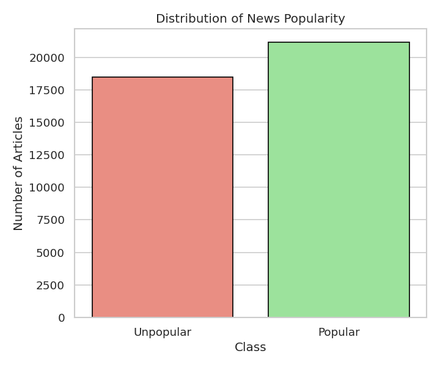
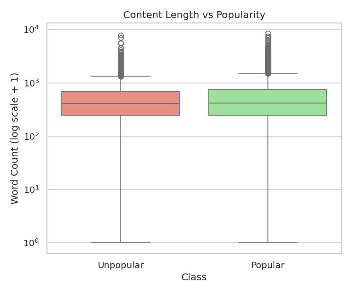
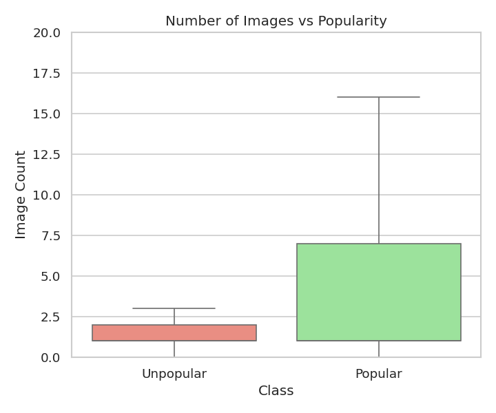
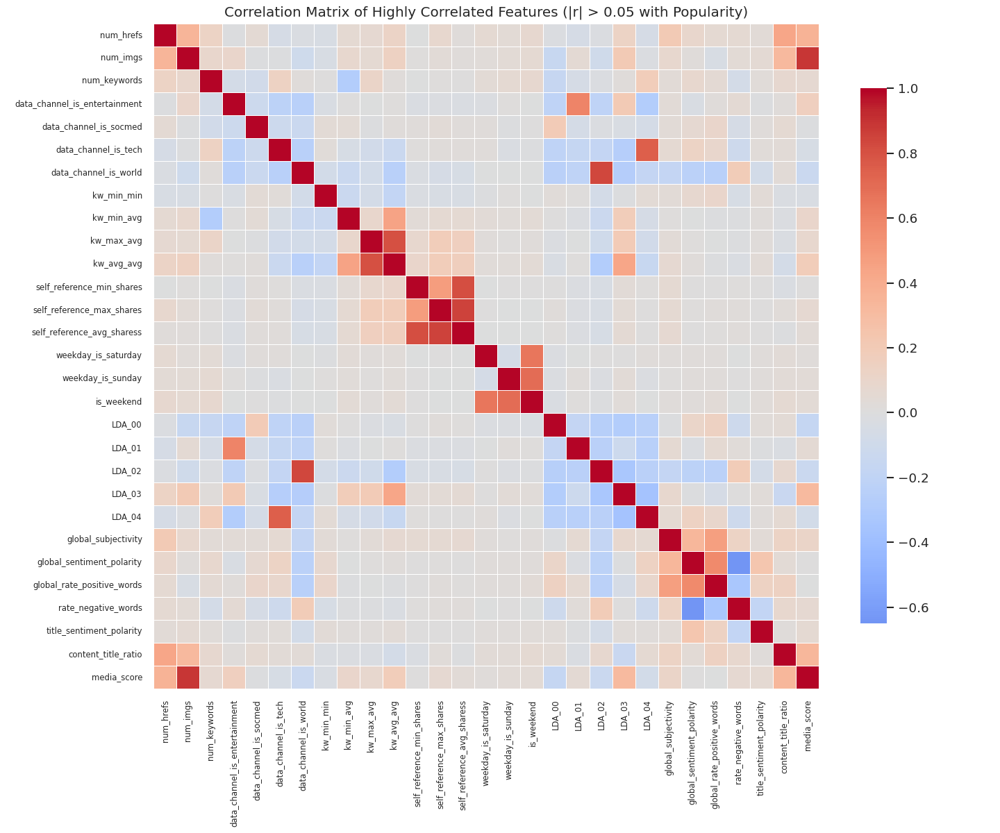
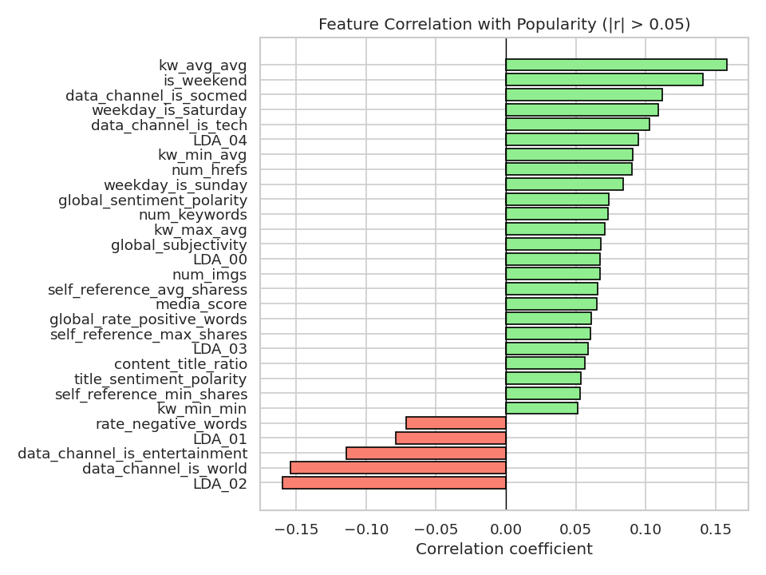
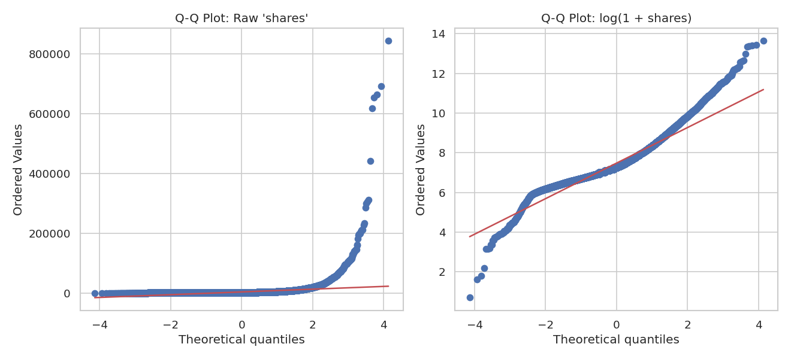

# Online News Popularity — Classification Project

Predicting whether a Mashable news article will be **Popular** or **Unpopular**
(median split on `shares`) using the
[Online News Popularity dataset](https://archive.ics.uci.edu/dataset/332/online+news+popularity)
(39,644 articles, 61 attributes, UCI Machine Learning Repository).

## Project overview

- **Goal:** binary classification of article popularity from content/meta-data features
  (no text of the article itself is used — only structural, keyword, sentiment, and
  timing features).
- **Target engineering:** `shares` is median-split into `Popular` / `Unpopular`, then
  dropped to avoid leakage.
- **Feature engineering:**
  - `content_title_ratio` = content length / (title length + 1)
  - `media_score` = number of images + number of videos
- **Feature selection:** numeric predictors are kept if `|correlation| > 0.05` with
  the (numeric-coded) target.
- **Pre-processing:** near-zero-variance predictors are removed, remaining numeric
  columns are standardized (z-score).
- **Sampling:** a 50% stratified subsample of the (already balanced-ish) data is
  taken to keep model training time reasonable, then split 80/20 (train/test), both
  via `caret::createDataPartition`.
- **Models trained:** Decision Tree (`rpart`), SVM with RBF kernel (`svmRadial`),
  Random Forest (`rf`) — all via `caret::train` with 3-fold CV and up-sampling on the
  training folds to correct for any residual class imbalance.

## Repository structure

```
.
├── R/
│   └── online_news_popularity_analysis.R   # Full analysis: EDA, feature engineering,
│                                            # modeling, evaluation (run this in R/RStudio)
├── data/
│   └── OnlineNewsPopularity.csv            # Raw dataset (UCI)
├── plots/
│   ├── 01_popularity_distribution.png
│   ├── 02_content_length_vs_popularity.png
│   ├── 03_num_images_vs_popularity.png
│   ├── 04_correlation_heatmap.png
│   ├── 05_feature_correlation_with_target.png
│   ├── 06_qq_plots_shares.png
│   ├── 07_qq_plots_predictors.png
│   └── summary_stats.txt
├── generate_plots.py                       # Python re-implementation of the EDA/plot
│                                            # step, used to render the PNGs above in
│                                            # environments without R installed
├── requirements.txt                        # Python deps for generate_plots.py
└── README.md
```

> **Why is there both an `.R` script and a `.py` script?**
> The analysis, feature engineering, and models were built in R (see `R/`). The PNG
> plots checked into `plots/` were rendered with `generate_plots.py` for convenience
> (e.g. viewing on GitHub or in environments without R), using the exact same
> transformations (median split, correlation threshold, etc.) as the R script, so the
> figures match what `Rscript R/online_news_popularity_analysis.R` produces locally.

## Exploratory plots

| | |
|---|---|
|  |  |
|  |  |
|  |  |

The **Q-Q plots** (`06_qq_plots_shares.png`) show that raw `shares` is heavily
right-skewed and far from normal, while `log(1 + shares)` is much closer to a
normal distribution — this is why a log scale is used for the content-length
boxplot and is worth considering if `shares` is ever modeled as a continuous
target instead of a binary class.

## How to reproduce

### R (full analysis + models)
```r
# from the repo root, in R or RStudio
setwd("R")
source("online_news_popularity_analysis.R")
```
Requires: `pacman`, `caret`, `dplyr`, `rpart`, `rpart.plot`, `e1071`, `ggplot2`,
`corrplot`, `gridExtra` (auto-installed via `pacman::p_load` if missing).

### Python (plots only)
```bash
pip install -r requirements.txt
python generate_plots.py
```

## Results

See the console output of `online_news_popularity_analysis.R` for the confusion
matrices / accuracy, sensitivity, specificity, and kappa for each of the three
models (Decision Tree, SVM, Random Forest) on the held-out test set.

## Data source

Fernandes, K., Vinagre, P., & Cortez, P. (2015). *Online News Popularity* [Dataset].
UCI Machine Learning Repository. https://doi.org/10.24432/C5NS3V
